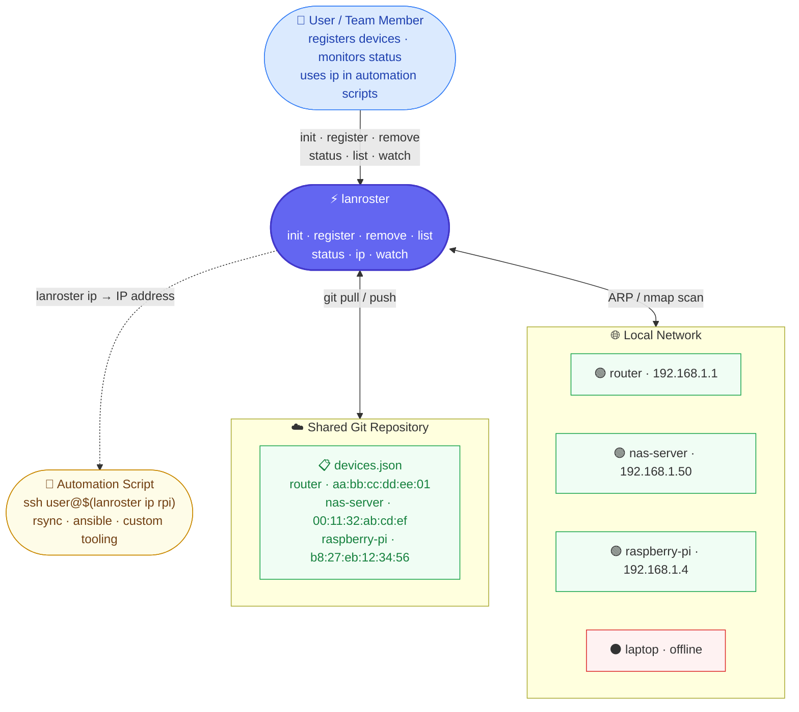

# lanroster

**A git-backed CLI for managing and monitoring your network device roster.**

Track every device on your LAN by MAC address. Keep the roster in a shared git
repository so the whole team sees the same list. Discover who's online in
seconds, and wire the `ip` command directly into your automation scripts.



---

## Why lanroster

| Problem | lanroster's answer |
|---|---|
| IP addresses change on every DHCP renewal | Identity is the MAC — stable across reboots |
| Scattered `/etc/hosts` files across machines | One shared `devices.json` in a git repo |
| "What's the IP of the NAS right now?" in a script | `ssh user@$(lanroster ip nas-server)` |
| Team members need to add their own devices | `register` validates, commits, and pushes |
| Spotting which devices are offline | `status` ARP-scans and renders a live table |

---

## Installation

### Recommended (from source)

```bash
git clone https://github.com/amq84/lanroster.git
cd lanroster
bash install.sh
```

### Manual

```bash
pip install .                       # core
pip install ".[vendor]"             # + MAC vendor lookup (recommended)
pip install ".[full]"               # + vendor + scapy ARP scan (best scan quality, needs root)
```

### Requirements

- Python 3.10+
- `git` available in `PATH`
- `nmap` (optional, improves scan without root)
- Root / `CAP_NET_RAW` (optional, enables full ARP scan via scapy)

---

## Quick Start

**Step 1 — Create a device-list repository**

Create a new GitHub/GitLab repo (e.g. `my-org/lan-devices`) with an empty
`devices.json` at the root (see [Device-List Repository](#device-list-repository)).

**Step 2 — Initialize**

```bash
lanroster init git@github.com:my-org/lan-devices.git
```

**Step 3 — Register your machine**

```bash
# Find your MAC address
ip link show eth0 | grep ether

lanroster register my-laptop aa:bb:cc:dd:ee:ff
```

**Step 4 — Check who's online**

```bash
lanroster status
```

**Step 5 — Use in scripts**

```bash
ssh admin@$(lanroster ip nas-server)
rsync -avz ~/backup/ admin@$(lanroster ip nas-server):/mnt/backup/
```

---

## Commands

### `init`

Clone (or update) the shared device-list repository and write the local config.

```bash
lanroster init <repo_url>
```

```
# HTTPS
lanroster init https://github.com/my-org/lan-devices.git

# SSH (recommended — no password prompts on push)
lanroster init git@github.com:my-org/lan-devices.git
```

If the repo does not contain a `devices.json` file, an empty one is created
automatically.

---

### `register`

Add a new device to the roster. Validates the MAC address format, checks for
name and MAC duplicates, then commits and pushes.

```bash
lanroster register <name> <mac>
```

```bash
lanroster register raspberry-pi b8:27:eb:12:34:56
lanroster register nas-server   00:11:32:ab:cd:ef
lanroster register workstation  e4:5f:01:23:45:67
```

**Rules for `name`:** letters, digits, hyphens, and underscores only.  
**Accepted MAC formats:** `aa:bb:cc:dd:ee:ff`, `aa-bb-cc-dd-ee-ff`, `aabbccddeeff`.  
All MACs are normalized to lowercase colon-separated form before storage.

---

### `remove`

Remove a device from the roster, commit, and push.

```bash
lanroster remove <name>
lanroster remove old-laptop          # prompts for confirmation
lanroster remove old-laptop --yes    # skip confirmation
```

---

### `list`

Show the full roster without performing any network scan.

```bash
lanroster list
lanroster list --json
```

```
 Registered Devices (4 total)
 ────────────────────────────────────────────────────────
 #   Name           MAC Address         Vendor         Last Seen
 1   router         aa:bb:cc:dd:ee:01   —              2h ago
 2   raspberry-pi   b8:27:eb:12:34:56   Raspberry Pi   5m ago
 3   nas-server     00:11:32:ab:cd:ef   Synology       1d ago
 4   workstation    e4:5f:01:23:45:67   Dell           3h ago
```

---

### `status`

ARP-scan the local network and show each registered device's connection status,
IP address, vendor, and last-seen time.

```bash
lanroster status
lanroster status --no-pull           # skip git pull before scanning
lanroster status --network 10.0.1.0/24   # override auto-detected subnet
lanroster status --json              # machine-readable output
```

```
 LanRoster — Network Status
 ──────────────────────────────────────────────────────────────────
   Device         MAC Address         Vendor         IP Address   Last Seen
   router         aa:bb:cc:dd:ee:01   —              192.168.1.1  2m ago
   raspberry-pi   b8:27:eb:12:34:56   Raspberry Pi   192.168.1.4  2m ago
 ○ nas-server     00:11:32:ab:cd:ef   Synology       —            1d ago
 ○ workstation    e4:5f:01:23:45:67   Dell           —            3h ago

 ┌ Summary ─────────────────────────────────────┐
 │ Online  ██████████████░░░░░░░░░░░░░░  2/4 (50%)  │
 │ Offline ██████████████░░░░░░░░░░░░░░  2/4 (50%)  │
 └──────────────────────────────────────────────┘
```

**Scan methods** (tried in order, best-first):

| Method | Requires | Quality |
|---|---|---|
| scapy ARP | root / `CAP_NET_RAW` + `pip install ".[full]"` | Complete — never misses a host |
| nmap `-sn` | `nmap` in `PATH` | Good — cross-refs ARP table for MACs |
| ping sweep + ARP | nothing | Degraded — misses hosts that block ICMP |

When a degraded method is used, a warning is printed with the suggested fix.

---

### `ip`

Print the current IP address of a named device. Designed for shell scripting —
outputs only the IP address, nothing else.

```bash
lanroster ip <name> [--network CIDR]
```

```bash
# Basic SSH
ssh admin@$(lanroster ip nas-server)

# SCP
scp report.pdf admin@$(lanroster ip workstation):~/Desktop/

# Ansible ad-hoc
ansible $(lanroster ip raspberry-pi) -m ping

# Check before connecting
if lanroster ip nas-server > /dev/null 2>&1; then
    rsync -avz ~/backup/ admin@$(lanroster ip nas-server):/mnt/backup/
else
    echo "NAS is offline, skipping backup"
fi
```

**Exit codes:**

| Code | Meaning |
|---|---|
| 0 | Device found — IP printed to stdout |
| 1 | Device is not reachable on the network |
| 2 | Device not in roster or scan error |

---

### `watch`

Continuously scan the network at a fixed interval. Re-renders the status table
in-place and appends a transition log when devices come online or go offline.
Sends a desktop notification via `notify-send` (Linux) or `osascript` (macOS).

```bash
lanroster watch
lanroster watch --interval 30          # scan every 30 seconds
lanroster watch -i 120 --network 10.0.0.0/24
```

Press **Ctrl+C** to exit and restore the terminal.

---

## JSON Output

`list` and `status` support `--json` for machine-readable output. All output
except the JSON is suppressed, making it safe to pipe.

```bash
# All devices with online status
lanroster status --json | jq '.[] | select(.online) | .ip'

# Offline devices
lanroster status --json | jq '.[] | select(.online == false) | .name'

# Export roster to CSV
lanroster list --json | jq -r '.[] | [.name, .mac, .vendor] | @csv'
```

**`status --json` schema:**

```json
[
  {
    "name":      "raspberry-pi",
    "mac":       "b8:27:eb:12:34:56",
    "vendor":    "Raspberry Pi Trading Ltd",
    "online":    true,
    "ip":        "192.168.1.4",
    "last_seen": "2025-05-01T18:32:00+00:00"
  }
]
```

**`list --json` schema:**

```json
[
  {
    "name":      "raspberry-pi",
    "mac":       "b8:27:eb:12:34:56",
    "vendor":    "Raspberry Pi Trading Ltd",
    "last_seen": "2025-05-01T18:32:00+00:00"
  }
]
```

---

## Device-List Repository

Any git repository with a `devices.json` file at the root can serve as a
device-list repo.

**Minimal `devices.json`:**

```json
{
  "devices": []
}
```

**With entries:**

```json
{
  "devices": [
    { "name": "router",       "mac": "aa:bb:cc:dd:ee:01" },
    { "name": "raspberry-pi", "mac": "b8:27:eb:12:34:56" },
    { "name": "nas-server",   "mac": "00:11:32:ab:cd:ef" }
  ]
}
```

**Recommended repository structure:**

```
my-lan-devices/
└── devices.json
```

Validate the file against the bundled JSON Schema:

```bash
# Using ajv-cli
ajv validate -s schema/lanroster-list.schema.json -d path/to/devices.json
```

---

## Schema Reference

The JSON Schema for `devices.json` is published at
[`schema/lanroster-list.schema.json`](schema/lanroster-list.schema.json).

| Field | Type | Required | Pattern |
|---|---|---|---|
| `devices` | array | yes | — |
| `devices[].name` | string | yes | `^[A-Za-z0-9_-]+$` |
| `devices[].mac` | string | yes | `^([0-9a-f]{2}:){5}[0-9a-f]{2}$` |

---

## Local State

lanroster stores two files in `~/.lanroster/`:

| File | Contents |
|---|---|
| `config.json` | Repo URL and local paths (written by `init`) |
| `seen.json` | Per-MAC last-seen timestamps (updated on every scan, never pushed) |
| `repo/` | Local clone of the device-list repository |

---

## MCP Server

lanroster ships an [MCP (Model Context Protocol)](https://modelcontextprotocol.io) server so
that Claude Desktop and other AI clients can call lanroster functionality as native tools —
no CLI commands needed. The AI can list devices, check network status, look up IPs, register
or remove devices, and detect unknown hardware, all from a conversation.

### Installation

```bash
pip install ".[mcp]"
```

### Claude Desktop configuration

Add the following to your Claude Desktop config file:

- **macOS:** `~/Library/Application Support/Claude/claude_desktop_config.json`
- **Linux:** `~/.config/claude/claude_desktop_config.json`

```json
{
  "mcpServers": {
    "lanroster": {
      "command": "lanroster-mcp"
    }
  }
}
```

Restart Claude Desktop after saving. The tools will appear automatically.

### Available tools

| Tool | What it does | When the AI uses it |
|---|---|---|
| `list_devices` | Return all registered devices (no scan) | Browsing the roster without touching the network |
| `get_network_status` | Scan the LAN and return online/offline status for every device | Checking current infrastructure state; results cached 60 s |
| `get_device_ip` | Return the current IP of a named device | Before any SSH, rsync, or network operation |
| `register_device` | Add a device to the roster and push to git | After confirming with the user |
| `remove_device` | Remove a device from the roster and push to git | After confirming with the user |
| `find_unknown_devices` | Return LAN hosts not in the roster | Detecting new hardware or unexpected guests |

### Example conversations

**Look up a device's IP before connecting:**
> *"What IP is the nas-server on right now?"*
> → Claude calls `get_device_ip` and replies: "The nas-server is at 192.168.1.50."

**Check who's online:**
> *"Which of my registered devices are currently offline?"*
> → Claude calls `get_network_status` and lists the unreachable devices with their last-seen times.

**Detect intruders:**
> *"Are there any unknown devices on my network?"*
> → Claude calls `find_unknown_devices` and returns a table of unregistered MAC addresses with vendors and IPs.

### Scan cache

Network scans take 10–30 seconds depending on the method (scapy → nmap → ping+arp).
`get_network_status` and `get_device_ip` share a 60-second in-memory cache so repeated
calls within the same session are instant. Pass `force_refresh: true` to `get_network_status`
to bypass the cache and trigger a fresh scan.

---

## Maintainer

**Abel Moreno** — [abelmqueralto@gmail.com](mailto:abelmqueralto@gmail.com)  
GitHub: [@amq84](https://github.com/amq84)

Issues and pull requests are welcome at
[github.com/amq84/lanroster](https://github.com/amq84/lanroster/issues).

---

## License

MIT — see [LICENSE](LICENSE) for details.
